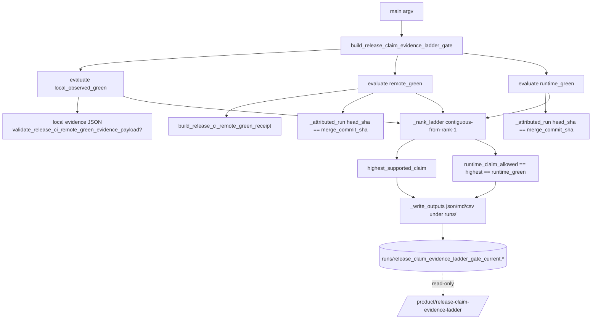

# Design Document

## Overview

This feature adds a read-only accounting builder that produces the artifact consumed by the
`/product/release-claim-evidence-ladder` surface (merged in PR #18). The surface exposes a
three-tier release-claim ladder (`local_observed_green` → `remote_green` → `runtime_green`)
but currently always reports the fail-closed default because no producer writes its artifact.

The builder, `tools/product/build_release_claim_evidence_ladder_gate.py`, reads owner/CI-supplied
evidence JSON, evaluates each tier in rank order, binds the `remote_green` and `runtime_green`
tiers to a concrete GitHub `workflow_run` id and `head_sha` attributed to a supplied
`merge_commit_sha`, and writes `runs/release_claim_evidence_ladder_gate_current.{json,md,csv}`.

It is strictly read-only accounting: `execution_enabled=false`, `external_state_mutated=false`,
no approval token required to run, writes only under `runs/`, opens no network requests, and
never fabricates workflow-run or runtime-smoke evidence. It reuses the existing remote-green
machinery rather than duplicating it.

### Goals

- Produce the ladder artifact set the surface reads, with fail-closed defaults.
- Attribute `remote_green`/`runtime_green` claims to a specific merge commit's workflow run,
  closing the PR #18 gap where merge-commit CI evidence was unattributed.
- Reuse `release_ci_remote_green_evidence_contract.py` and `build_release_ci_remote_green_receipt.py`.

### Non-Goals

- Running GitHub workflows, ROCm runtime smoke, or any benchmark execution.
- Mutating external state, submitting to GitHub/CASP, or requiring approval tokens to run.
- Fabricating evidence: the actual remote/runtime green results are owner/CI-supplied inputs.

## Requirements Mapping

| Requirement | Design element |
|---|---|
| R1 Produce artifact set | `build_release_claim_evidence_ladder_gate()` + `_write_outputs()` (json/md/csv) |
| R2 Fail-closed defaults | `_evaluate_tier()` returns `not_supported` on missing/invalid; defaults initialized before evaluation |
| R3 Tiered ladder semantics | `_rank_ladder()` contiguous-from-rank-1 rule; `runtime_claim_allowed = (highest == runtime_green)` |
| R4 Workflow-run attribution | `_attributed_run(records, merge_commit_sha)` with head_sha match + timestamp tie-break |
| R5 Reuse machinery | imports from `release_ci_remote_green_evidence_contract` + `build_release_ci_remote_green_receipt` |
| R6 Read-only boundaries | constant `CLAIM_BOUNDARY`, `execution_enabled=false`, `external_state_mutated=false`, `runs/`-only writes |
| R7 Round-trip serialization | `json.dumps(..., sort_keys=True)`; pure dict payload, no nondeterministic types |
| R8 Idempotence/determinism | no wall-clock in reproducibility-relevant fields; sorted keys; byte-identical output |

## Architecture



### Module placement

`tools/product/build_release_claim_evidence_ladder_gate.py`, mirroring the structure of
`tools/product/build_release_ci_remote_green_receipt.py` (module-level `ROOT`,
`DEFAULT_OUT_*`, `CLAIM_BOUNDARY`, a `build_*` function returning `{"summary","rows",...}`,
helper functions, and `main(argv)` CLI).

## Components and Interfaces

### Tier definitions

```python
TIER_LOCAL = "local_observed_green"   # rank 1
TIER_REMOTE = "remote_green"          # rank 2
TIER_RUNTIME = "runtime_green"        # rank 3
TIER_RANK = {TIER_LOCAL: 1, TIER_REMOTE: 2, TIER_RUNTIME: 3}
NONE_CLAIM = "none"
```

### Core function

```python
def build_release_claim_evidence_ladder_gate(
    *,
    root: str | Path = ROOT,
    merge_commit_sha: str = "",
    local_evidence_json: str | Path | None = "",      # local tests/builders green evidence
    remote_runs_json: str | Path | None = "",         # workflow runs for remote_green attribution
    runtime_runs_json: str | Path | None = "",        # ROCm/HIP runtime smoke runs for runtime_green attribution
    # remote_green receipt inputs (reused machinery, optional)
    runner_inventory_json: str | Path | None = "",
    branch_json: str | Path | None = "",
    required_checks_json: str | Path | None = "",
    schedule_runs_json: str | Path | None = "",
    failed_run_artifacts_json: str | Path | None = "",
    release_tag_runs_json: str | Path | None = "",
    workflow_yml: str | Path | None = DEFAULT_WORKFLOW_YML,
) -> dict[str, Any]:
    ...
```

Returns `{"summary": {...}, "tiers": [...], "blockers": [...]}`.

### Attribution helper

```python
def _attributed_run(records: list[dict], merge_commit_sha: str) -> dict | None:
    """Return the most-recently-completed Attributed_Run, or None.

    Attributed_Run := record where
      head_sha == merge_commit_sha (case-insensitive 40-hex compare)
      AND status == "completed" AND conclusion == "success".
    Records with mismatched head_sha are Unattributed_Run and excluded.
    Ties broken by max updated_at/run_completed_at timestamp (lexical ISO-8601).
    """
```

### Tier evaluation

```python
def _evaluate_tier(tier: str, *, supported: bool, attributed_run: dict | None,
                   block_reason: str, validation_error: str = "") -> dict:
    return {
        "tier": tier,
        "rank": TIER_RANK[tier],
        "result": "supported" if supported else "not_supported",
        "workflow_run_id": (attributed_run or {}).get("id") if supported else None,
        "head_sha": (attributed_run or {}).get("head_sha") if supported else None,
        "block_reason": "" if supported else block_reason,   # e.g. "unattributed", "missing_evidence", "validation_error"
        "validation_error": validation_error,
    }
```

- `local_observed_green`: supported when the local evidence JSON validates and reports
  success (no workflow-run attribution required for rank 1).
- `remote_green`: evaluated via reused `build_release_ci_remote_green_receipt(...)`
  (`summary["pass"] is True`) AND an `_attributed_run` exists in `remote_runs_json` for the
  merge commit. If the receipt passes but no attributed run exists → `not_supported`,
  `block_reason="unattributed"`.
- `runtime_green`: supported when `runtime_runs_json` contains an `_attributed_run` for the
  merge commit (ROCm/HIP runtime smoke success), else `not_supported`.

### Ladder ranking (contiguous-from-rank-1)

```python
def _rank_ladder(tier_results: dict[str, dict]) -> tuple[str, list[str]]:
    highest = NONE_CLAIM
    gaps = []
    for tier in (TIER_LOCAL, TIER_REMOTE, TIER_RUNTIME):  # ascending rank
        if tier_results[tier]["result"] == "supported":
            highest = tier
        else:
            # record any higher supported tier as a gap; stop climbing
            for higher in (t for t in (TIER_REMOTE, TIER_RUNTIME)
                           if TIER_RANK[t] > TIER_RANK[tier]
                           and tier_results[t]["result"] == "supported"):
                gaps.append(f"{higher}_supported_but_{tier}_not_supported")
            break
    return highest, gaps
```

`runtime_claim_allowed = (highest == TIER_RUNTIME)`.

## Data Models

### JSON artifact (`runs/release_claim_evidence_ladder_gate_current.json`)

```json
{
  "summary": {
    "packet_type": "release_claim_evidence_ladder_gate",
    "schema_version": "release_claim_evidence_ladder_gate_v1",
    "status": "release_claim_evidence_ladder_ready | blocked_release_claim_evidence_ladder",
    "merge_commit_sha": "<40-hex or ''>",
    "highest_supported_claim": "none|local_observed_green|remote_green|runtime_green",
    "runtime_claim_allowed": false,
    "local_observed_green_supported": false,
    "remote_green_supported": false,
    "runtime_green_supported": false,
    "contiguity_gap_count": 0,
    "contiguity_gaps": [],
    "evidence_contract_schema_version": "release_ci_remote_green_evidence_contract_v1",
    "remote_green_receipt_status": "release_ci_remote_green_ready|blocked_release_ci_remote_green|not_evaluated",
    "execution_enabled": false,
    "external_state_mutated": false,
    "claim_boundary": "<read-only statement>",
    "next_required_step": "<text>"
  },
  "tiers": [ { "tier": "...", "rank": 1, "result": "supported|not_supported",
              "workflow_run_id": null, "head_sha": null, "block_reason": "", "validation_error": "" } ],
  "blockers": [ { "tier": "...", "code": "unattributed|missing_evidence|validation_error|remote_receipt_blocked", "observed": "..." } ]
}
```

`highest_supported_claim` and `runtime_claim_allowed` are the exact field contract the
surface reads (R1.7). `highest_supported_claim` is a tier identifier or `"none"`;
`runtime_claim_allowed` is a JSON boolean.

### CSV (`...current.csv`) — one row per tier (R1.3)

Columns: `tier, rank, result, workflow_run_id, head_sha, block_reason`.

### MD (`...current.md`)

Summary header (status, merge_commit_sha, highest_supported_claim, runtime_claim_allowed,
evidence_contract_schema_version) + per-tier table + claim-boundary section.

## Error Handling

- **Invalid/absent `merge_commit_sha`** (not 40-hex): builder records
  `status=blocked_release_claim_evidence_ladder`, all attribution-dependent tiers
  `not_supported` with `block_reason="invalid_merge_commit_sha"`, and `highest_supported_claim`
  may still be `local_observed_green` if local evidence is valid (rank 1 needs no attribution).
  Per R4.8 framing, surface still gets a complete artifact (no crash, fail-closed).
- **Missing/empty/non-object evidence input**: tier `not_supported`, `block_reason="missing_evidence"`.
- **Evidence_Contract shape validation failure**: tier `not_supported`,
  `block_reason="validation_error"`, `validation_error` populated (R2.5).
- **Unattributed run** (no `head_sha == merge_commit_sha` success record):
  `block_reason="unattributed"` (R4.4).
- **Fail-closed write semantics** (R1.8): write JSON to a temp path in `runs/` then
  `os.replace()` to the final path so a failure never leaves partial JSON and preserves the
  prior artifact; md/csv written after the JSON commit.

## Reuse of Existing Machinery (R5)

- `from tools.product.release_ci_remote_green_evidence_contract import (`
  `CONTRACT_SCHEMA_VERSION, EVIDENCE_INPUTS, validate_release_ci_remote_green_evidence_payload,`
  `validate_release_ci_remote_green_evidence_files, build_release_ci_remote_green_evidence_contract)`
- `from tools.product.build_release_ci_remote_green_receipt import build_release_ci_remote_green_receipt`
- `remote_green` tier delegates its non-attribution checks to
  `build_release_ci_remote_green_receipt(...)` and records `summary["status"]` as
  `remote_green_receipt_status`; the new builder only adds the merge-commit attribution layer
  on top.
- `evidence_contract_schema_version` is recorded from `CONTRACT_SCHEMA_VERSION` (R5.4).
- Evidence input paths for the remote receipt are sourced from `EVIDENCE_INPUTS` defaults,
  not redefined (R5.3).

## CLI

```
python3 tools/product/build_release_claim_evidence_ladder_gate.py \
  --merge-commit-sha <40-hex> \
  --local-evidence-json runs/release_local_observed_green_current.json \
  --remote-runs-json runs/release_ci_merge_commit_runs_current.json \
  --runtime-runs-json runs/release_ci_runtime_smoke_runs_current.json \
  [remote-receipt inputs: --runner-inventory-json ... --branch-json ... etc] \
  --out-json runs/release_claim_evidence_ladder_gate_current.json \
  --out-md   runs/release_claim_evidence_ladder_gate_current.md \
  --out-csv  runs/release_claim_evidence_ladder_gate_current.csv
```

`main(argv)` returns `0` when status is ready, non-zero when blocked (matching the repo's
receipt-builder exit convention), without raising on missing evidence (fail-closed).

## Testing Strategy

New `tests/unit/test_build_release_claim_evidence_ladder_gate.py`:

Example-based:
- missing all evidence → `highest_supported_claim == "none"`, `runtime_claim_allowed is False`,
  `execution_enabled is False`, `external_state_mutated is False`.
- local-only valid evidence → `highest_supported_claim == "local_observed_green"`.
- remote receipt pass + attributed run for merge sha → `remote_green` supported.
- remote receipt pass but no run with matching head_sha → `remote_green` not supported,
  `block_reason == "unattributed"` (the PR #18 gap).
- runtime attributed run present → `runtime_green` supported, `runtime_claim_allowed is True`.
- contiguity: runtime supported but remote not → `highest_supported_claim == "local_observed_green"`
  (or `none`), gap recorded, `runtime_claim_allowed is False`.
- mismatched head_sha record excluded from attribution.
- multiple matching attributed runs → most-recent-completion run is selected.

Property-based (Hypothesis), explicitly called out per requirements:
- **Never over-claim** (R3/R4.7): for arbitrary tier-support combinations,
  `TIER_RANK[highest_supported_claim]` ≤ rank of the highest tier with an attributed run, and
  the highest claim is always a contiguous-from-rank-1 supported tier.
- **Fail-closed** (R2): for arbitrary missing/empty/malformed inputs, no tier is supported and
  `highest_supported_claim == "none"`.
- **Round-trip** (R7): `json.loads(json.dumps(payload, sort_keys=True))` equals `payload`.
- **Idempotence/determinism** (R8): two runs on identical inputs produce byte-identical JSON.

Tests are pure-local (tmp_path), no network, no rdkit dependency. Verification:
`./scripts/ai-verify.sh` plus the focused test module.

## Correctness Properties

These properties are invariants the implementation must hold for any input, and are the
direct targets of the property-based tests above.

### Property 1: Never over-claim (monotone attribution bound)
For all evidence combinations, `TIER_RANK[highest_supported_claim]` is less than or equal to
the rank of the highest tier that has an `Attributed_Run` (or local validation for rank 1).
The builder never reports a claim the evidence does not attribute.
**Validates: Requirements 3.5, 3.6, 3.7, 4.7**

### Property 2: Contiguity from rank 1
`highest_supported_claim` is either `none` or a tier `t` such that every tier with rank ≤
rank(`t`) is supported. A higher supported tier above an unsupported lower tier never raises
the claim; it is recorded as a contiguity gap.
**Validates: Requirements 3.6**

### Property 3: Fail-closed default
If no tier has an input that passes Evidence_Contract validation, then
`highest_supported_claim == "none"` and `runtime_claim_allowed is False`.
**Validates: Requirements 2.1, 2.2, 2.3, 2.4**

### Property 4: Runtime claim iff runtime tier
`runtime_claim_allowed` is `true` if and only if `highest_supported_claim == "runtime_green"`.
**Validates: Requirements 3.7**

### Property 5: Attribution exactness
A tier is attributed only by a `workflow_run` whose `head_sha` equals `merge_commit_sha` with
`status=completed` and `conclusion=success`; any mismatched `head_sha` record is excluded.
**Validates: Requirements 4.2, 4.3, 4.4, 4.5, 4.6**

### Property 6: Deterministic selection
When multiple `Attributed_Run` records match, selection is the most recent completion
timestamp, so identical inputs always select the same run.
**Validates: Requirements 4.9**

### Property 7: Round-trip fidelity
`json.loads(serialize(result)) == result` for the emitted artifact.
**Validates: Requirements 7.1, 7.2, 7.3**

### Property 8: Idempotence
Two runs on identical inputs produce byte-identical JSON; no wall-clock-dependent value
appears in reproducibility-relevant fields.
**Validates: Requirements 8.1, 8.2, 8.3**

### Property 9: Read-only invariance
Every emitted artifact has `execution_enabled == false` and `external_state_mutated == false`,
regardless of evidence.
**Validates: Requirements 6.1, 6.2**

## Safety / AGENTS.md Alignment

- Read-only: no commit/push/deploy/submit; writes only `runs/` artifacts (gitignored run state).
- No CASP target lookup, no external structures, no `.env` access.
- No approval token consumed to run; the artifact reports claim posture, it does not promote claims.
