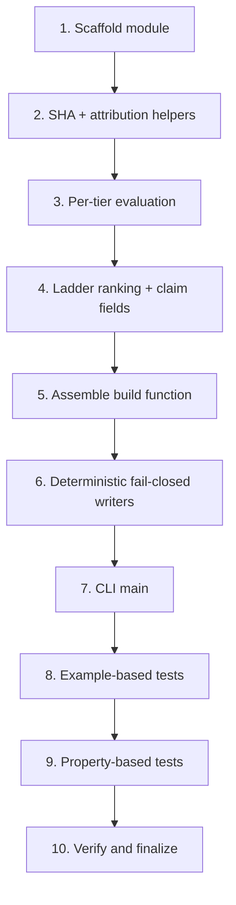

# Implementation Plan

## Overview

Implement `tools/product/build_release_claim_evidence_ladder_gate.py`, a read-only accounting
builder that produces `runs/release_claim_evidence_ladder_gate_current.{json,md,csv}` consumed
by the `/product/release-claim-evidence-ladder` surface. The builder evaluates the three-tier
release-claim ladder (`local_observed_green` → `remote_green` → `runtime_green`), binds the
remote/runtime tiers to a GitHub `workflow_run` attributed to a supplied `merge_commit_sha`,
fails closed, reuses the existing remote-green machinery, and is fully deterministic.

Tasks are ordered so each builds on prior ones: scaffolding and helpers first, then tier
evaluation, ranking, assembly, writers, CLI, and finally example-based and property-based
tests plus verification.

## Tasks

- [x] 1. Scaffold the builder module with constants and read-only boundaries
  - Create `tools/product/build_release_claim_evidence_ladder_gate.py` mirroring the structure of `tools/product/build_release_ci_remote_green_receipt.py` (module `ROOT`, `DEFAULT_OUT_JSON/MD/CSV`, `DEFAULT_WORKFLOW_YML`, `CLAIM_BOUNDARY`).
  - Define tier constants `TIER_LOCAL`, `TIER_REMOTE`, `TIER_RUNTIME`, `TIER_RANK`, `NONE_CLAIM` and `SCHEMA_VERSION = "release_claim_evidence_ladder_gate_v1"`.
  - Add the import surface from `release_ci_remote_green_evidence_contract` (`CONTRACT_SCHEMA_VERSION`, `EVIDENCE_INPUTS`, `validate_release_ci_remote_green_evidence_payload`, `validate_release_ci_remote_green_evidence_files`, `build_release_ci_remote_green_evidence_contract`) and `build_release_ci_remote_green_receipt`.
  - _Requirements: 5.1, 5.2, 5.3, 6.1, 6.2, 6.6_

- [x] 2. Implement merge-commit and JSON input helpers
  - [x] 2.1 Implement `_is_merge_commit_sha(value)` validating a 40-char hexadecimal SHA, and a `_read_json(root, path)` helper consistent with the existing receipt builder.
    - _Requirements: 4.1, 4.8, 2.4_
  - [x] 2.2 Implement `_attributed_run(records, merge_commit_sha)` returning the most-recently-completed run where `head_sha == merge_commit_sha` (case-insensitive), `status == "completed"`, `conclusion == "success"`; exclude mismatched `head_sha`; tie-break by max completion timestamp; return `None` when no match.
    - _Requirements: 4.2, 4.3, 4.4, 4.5, 4.6, 4.9_

- [x] 3. Implement per-tier evaluation
  - [x] 3.1 Implement `_evaluate_tier(...)` producing the per-tier result dict (`tier`, `rank`, `result`, `workflow_run_id`, `head_sha`, `block_reason`, `validation_error`).
    - _Requirements: 1.4, 2.5_
  - [x] 3.2 Implement `local_observed_green` evaluation: supported only when the local evidence JSON is present, a JSON object, validates, and reports success; else `not_supported` with `block_reason` (`missing_evidence`/`validation_error`).
    - _Requirements: 3.2, 2.4, 2.5_
  - [x] 3.3 Implement `remote_green` evaluation: call `build_release_ci_remote_green_receipt(...)`, require `summary["pass"] is True`, AND require an `_attributed_run` in the remote runs evidence for the merge commit; record `remote_green_receipt_status`; unattributed → `not_supported`, `block_reason="unattributed"`.
    - _Requirements: 3.3, 4.2, 4.4, 5.2_
  - [x] 3.4 Implement `runtime_green` evaluation: supported only when the runtime runs evidence contains an `_attributed_run` for the merge commit; else `not_supported`.
    - _Requirements: 3.4, 4.3, 4.4_

- [x] 4. Implement ladder ranking and claim fields
  - Implement `_rank_ladder(tier_results)` returning `(highest_supported_claim, gaps)` using the contiguous-from-rank-1 rule; record `contiguity_gaps`/`contiguity_gap_count`.
  - Initialize `runtime_claim_allowed = False` before evaluation; set it `True` iff `highest_supported_claim == TIER_RUNTIME`.
  - Default `highest_supported_claim` to `NONE_CLAIM` when no rank-1 support.
  - _Requirements: 3.1, 3.5, 3.6, 3.7, 2.1, 2.2, 2.3, 4.7_

- [x] 5. Assemble `build_release_claim_evidence_ladder_gate(...)`
  - Wire inputs (merge_commit_sha, local/remote/runtime evidence paths, reused remote-receipt inputs), run tier evaluations and ranking, and assemble the `summary` (including `packet_type`, `schema_version`, `status`, `merge_commit_sha`, `highest_supported_claim`, `runtime_claim_allowed`, per-tier `*_supported` flags, `evidence_contract_schema_version` from `CONTRACT_SCHEMA_VERSION`, `execution_enabled=false`, `external_state_mutated=false`, `claim_boundary`, `next_required_step`), plus `tiers` and `blockers` lists.
  - Set `status` to `release_claim_evidence_ladder_ready` only when no blockers, else `blocked_release_claim_evidence_ladder`.
  - Handle invalid/absent `merge_commit_sha` fail-closed (attribution tiers `not_supported` with `block_reason="invalid_merge_commit_sha"`; still emit a complete artifact).
  - _Requirements: 1.4, 1.5, 1.6, 4.1, 4.8, 5.4, 6.1, 6.2, 6.6, 6.7_

- [x] 6. Implement deterministic, fail-closed output writers
  - [x] 6.1 Implement JSON writer using `json.dumps(payload, indent=2, ensure_ascii=False, sort_keys=True)` written to a temp file under `runs/` then `os.replace()` to the final path (no partial JSON; prior artifact preserved on failure).
    - _Requirements: 1.1, 6.5, 7.1, 7.3, 8.2, 1.8_
  - [x] 6.2 Implement `.csv` writer with one row per tier (`tier, rank, result, workflow_run_id, head_sha, block_reason`) and `.md` summary writer (header + per-tier table + claim-boundary section).
    - _Requirements: 1.2, 1.3_
  - [x] 6.3 Ensure no wall-clock-dependent value appears in reproducibility-relevant fields.
    - _Requirements: 8.1, 8.3_

- [x] 7. Implement the CLI `main(argv)`
  - Add argparse for `--merge-commit-sha`, `--local-evidence-json`, `--remote-runs-json`, `--runtime-runs-json`, the reused remote-receipt input args, and `--out-json/--out-md/--out-csv`.
  - Return `0` when status is ready, non-zero when blocked, without raising on missing evidence.
  - _Requirements: 1.1, 2.4, 6.3, 6.4_

- [x] 8. Example-based unit tests
  - Create `tests/unit/test_build_release_claim_evidence_ladder_gate.py` covering: missing-all-evidence → `none`/`runtime_claim_allowed False`; local-only valid → `local_observed_green`; remote receipt pass + attributed run → `remote_green`; remote pass but no matching head_sha → `unattributed`; runtime attributed → `runtime_green`/`runtime_claim_allowed True`; contiguity (runtime supported, remote not); mismatched head_sha excluded; multiple matches select most recent.
  - _Requirements: 1.4, 2.1, 3.2, 3.3, 3.4, 3.6, 4.4, 4.5, 4.6, 4.9_

- [x] 9. Property-based tests (Hypothesis)
  - Add property tests for: never over-claim (Property 1), contiguity (Property 2), fail-closed (Property 3), runtime-claim-iff (Property 4), round-trip (Property 7), idempotence/byte-identical (Property 8), read-only invariance (Property 9).
  - _Requirements: 2.1, 3.5, 3.6, 3.7, 4.7, 6.1, 6.2, 7.2, 8.1, 8.2_

- [x] 10. Verify and finalize
  - Run `./scripts/ai-verify.sh` and the focused test module; run the builder once against fail-closed (no evidence) inputs to emit the artifact and confirm `highest_supported_claim=none`, `runtime_claim_allowed=false`.
  - Confirm the emitted JSON field contract matches what `/product/release-claim-evidence-ladder` reads (`highest_supported_claim`, `runtime_claim_allowed` types).
  - _Requirements: 1.7, 2.1, 2.2, 6.1, 6.2_

## Task Dependency Graph

```json
{
  "waves": [
    { "wave": 1, "tasks": ["1"], "parallel": false },
    { "wave": 2, "tasks": ["2.1", "2.2"], "parallel": true },
    { "wave": 3, "tasks": ["3.1"], "parallel": false },
    { "wave": 4, "tasks": ["3.2", "3.3", "3.4"], "parallel": true },
    { "wave": 5, "tasks": ["4"], "parallel": false },
    { "wave": 6, "tasks": ["5"], "parallel": false },
    { "wave": 7, "tasks": ["6.1", "6.2", "6.3"], "parallel": true },
    { "wave": 8, "tasks": ["7"], "parallel": false },
    { "wave": 9, "tasks": ["8"], "parallel": false },
    { "wave": 10, "tasks": ["9"], "parallel": false },
    { "wave": 11, "tasks": ["10"], "parallel": false }
  ]
}
```



## Notes

- All work is read-only accounting: `execution_enabled=false`, `external_state_mutated=false`,
  no approval token to run, writes only under `runs/`, no network requests, never fabricate
  workflow-run/runtime evidence (AGENTS.md safety boundaries; CASP no-leak applies).
- Reuse `release_ci_remote_green_evidence_contract.py` and
  `build_release_ci_remote_green_receipt.py`; do not duplicate remote-green logic.
- The actual remote workflow runs and ROCm runtime smoke results remain owner/CI-supplied
  evidence; this builder consumes, validates, and attributes them only.
- Property-based tests (task 9) require Hypothesis; if not already a dev dependency, gate the
  module with `pytest.importorskip("hypothesis")`.
- Verify with `./scripts/ai-verify.sh` and the focused test module before marking complete.
