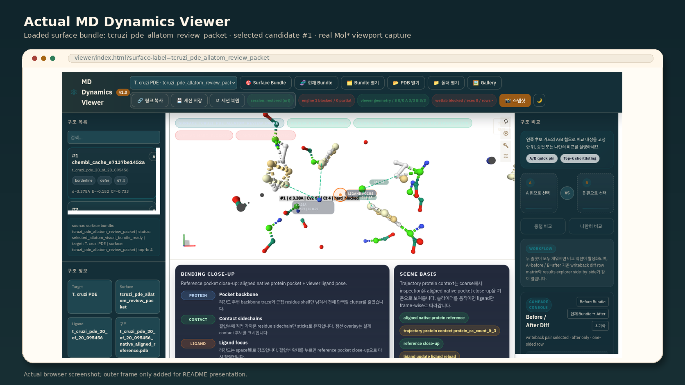
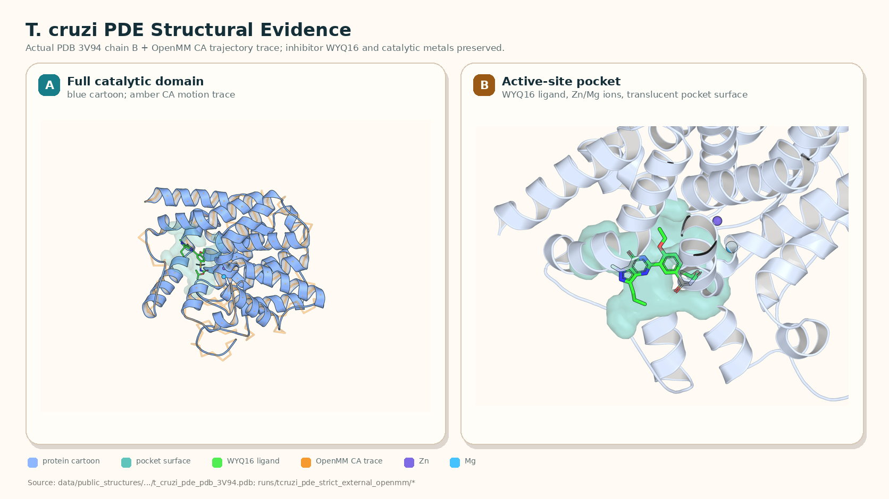

# 리간드 도킹 및 분자동역학 납품 엔진

[English README](README.md)

이 저장소는 로컬 납품 방식의 분자동역학 및 리간드 검증 스택입니다. 핵심 방향은 물리 기반 `O(N)` 실행 경로, 제한된 AI residual 보정, 재현 가능한 게이트, 그리고 로컬 데이터는 노출하지 않으면서 검토 가능한 납품 산출물을 만드는 것입니다.

GitHub에는 소스코드, 설정, 테스트, 문서, 스키마, 납품 템플릿을 저장합니다. 분자동역학 실행 데이터와 무거운 로컬 산출물은 의도적으로 제외합니다.

## 저장소 구성

| 영역 | 역할 |
| --- | --- |
| `core/` | 물리 기반 MD 엔진 핵심 로직, integrator, topology, AI residual routing, spatial kernel, GPU/runtime 지원 코드입니다. |
| `rust_engine/` | Rust/HIP 가속 엔진 스캐폴딩과 native build 표면입니다. 빌드 결과물은 Git에서 제외됩니다. |
| `tools/` | 게이트, manifest, 납품 bundle, wetlab packet, evidence ledger, benchmark summary, 상용화 readiness를 만드는 CLI 도구입니다. |
| `tests/` | 엔진 동작, 납품 게이트, 검증 산출물, packet builder, regression guard에 대한 테스트입니다. |
| `config/` | target policy, calibration input, scorecard, acceptance threshold, runtime preset, gate 설정입니다. |
| `docs/` | 아키텍처 노트, 검증 계획, 로컬 납품 runbook, wetlab handoff 문서, 논문 초안, target-family roadmap입니다. |
| `docs/wetlab_packets/` | 파트너/실험팀 전달용 lightweight wetlab packet 템플릿과 CSV control 파일입니다. |
| `benchmark/` | 정확도 및 성능 benchmark entry point입니다. |
| `train/` | residual model training pipeline entry point입니다. |
| `api/`, `viewer/`, `deploy/`, `monitoring/` | 로컬 서비스, 시각화, 배포, 운영 모니터링 스캐폴딩입니다. |
| `requirements*.txt` | runtime, development, API, training, deployment, optional dependency를 나눈 파일입니다. |

## GitHub에 올리지 않는 것

`.gitignore`를 통해 아래 항목은 GitHub에 올라가지 않도록 제외했습니다.

- `data/`, `runs/`, `output/`, `logs/`, `models/`, `archives/`, `tmp/`, `runtime/cache/`
- `.env`, `.env.*`, 로컬 agent metadata, virtualenv, Python cache, test cache
- `*.so`, `*.dll`, `*.o`, Rust `target/`, 다운로드된 로컬 tool bundle 같은 build/native 산출물
- `*.h5`, `*.npz`, `*.pt`, `*.pth`, `*.onnx`, `*.tar.gz`, `*.tar.zst` 같은 대형 모델/배열/압축 산출물

즉 GitHub에는 재현 가능한 구현과 문서가 올라가고, 무거운 MD trajectory, 생성 dataset, local model checkpoint, 납품 output은 로컬에 남기는 구조입니다.

## 핵심 원칙

1. 기본 계산 경로는 `O(N)`을 유지합니다.
2. 속도를 위해 과학적 정확도를 희생하지 않습니다.
3. AI는 물리 엔진을 대체하지 않고, 제한된 residual 보정으로만 사용합니다.
4. provenance, wetlab evidence, queue 상태, 납품 gate가 불완전하면 fail-closed로 막습니다.
5. 생성된 evidence는 fingerprint와 provenance를 갖추고, 소스코드와 분리합니다.

## 빠른 시작

```bash
python3 -m venv .venv
source .venv/bin/activate
pip install -r requirements.txt
pip install -r requirements-dev.txt
```

납품 게이트 관련 핵심 테스트만 빠르게 실행:

```bash
python3 -m pytest -q \
  tests/unit/test_build_local_delivery_verdict_gate.py \
  tests/unit/test_validate_wetlab_tcruzi_pde_allatom_rescue_attempt.py \
  tests/unit/test_run_wetlab_tcruzi_pde_allatom_rescue.py
```

로컬 납품 verdict gate 실행:

```bash
python3 tools/validate_wetlab_tcruzi_pde_allatom_rescue_attempt.py
python3 tools/build_local_delivery_verdict_gate.py
```

이 verdict gate는 필수 P0 evidence, wetlab 상태, delivery readiness 조건이 모두 충족되기 전까지 의도적으로 fail-closed 됩니다.

## 주요 워크플로우

| 워크플로우 | 주요 entry point |
| --- | --- |
| 로컬 납품 preflight | `tools/run_local_delivery_preflight.py`, `tools/build_local_delivery_bundle.py`, `tools/validate_local_delivery_bundle.py` |
| P0 납품 verdict | `tools/build_local_delivery_verdict_gate.py`, `docs/local_delivery_p0_gate.md`, `docs/local_delivery_verdict_template.md` |
| PDE rescue provenance | `tools/run_wetlab_tcruzi_pde_allatom_rescue.py`, `tools/validate_wetlab_tcruzi_pde_allatom_rescue_attempt.py` |
| 정확도 및 regression gate | `tools/validate_accuracy_gate.py`, `tools/check_strict_release_regression.py`, `benchmark/accuracy_bench.py` |
| nightly/local 운영 | `tools/run_nightly_screening_batch.py`, `tools/run_nightly_ops.sh` |
| 상용화 readiness | `tools/build_commercialization_readiness_report.py`, `tools/build_ligand_scaleup_suite_status.py`, local-delivery 문서, 생성된 verdict artifact |

## 로컬 납품 문서

납품 준비 상태를 볼 때는 아래 문서부터 보면 됩니다.

- `docs/local_delivery_runbook.md`
- `docs/local_delivery_p0_gate.md`
- `docs/local_delivery_manifest_template.md`
- `docs/local_delivery_bundle_schema.md`
- `docs/local_delivery_verdict_template.md`
- `docs/local_delivery_engine_provenance.md`
- `docs/local_delivery_claim_policy.md`
- `docs/post_green_improvement_plan.md`

## 현재 검증 스냅샷

업데이트: 2026-05-18 KST.





첫 번째 이미지는 `surface-label=tcruzi_pde_allatom_review_packet`을 로드한 실제 `viewer/index.html` 브라우저 캡처를 README용으로 프레이밍한 것입니다. 두 번째 이미지는 로컬 분석에 사용된 `runs/tcruzi_pde_strict_external_openmm/tcruzi_pde_3v94_chain_B.pdb`와 `runs/tcruzi_pde_strict_external_openmm/tcruzi_pde_chain_B_openmm_ca_md.npy`를 기반으로 만든 AlphaFold 스타일의 결정적 PyMOL 렌더입니다. 정확한 claim 경계와 수치는 아래 표를 기준으로 봅니다.

manifest에 명시된 로컬 T. cruzi PDE OpenMM artifact가 존재하면 두 README 이미지는 `python3 tools/render_readme_molecular_figures.py`로 다시 생성할 수 있습니다. 이미 검증된 asset 주변의 manifest만 갱신할 때만 `--skip-browser` 또는 `--skip-pymol`을 사용합니다. 현재 provenance manifest는 `docs/figures/readme_molecular_figures_manifest_current.json`에 기록됩니다.

`runs/` 아래 runtime artifact는 로컬에만 남고 Git에서는 제외됩니다. 아래 표는 로컬에서 어떤 파일을 먼저 열어야 하는지와 현재 해석을 요약합니다.

| Lane | 현재 상태 | 주요 로컬 artifact | 먼저 볼 데이터 | 해석 |
| --- | --- | --- | --- | --- |
| 제한 로컬 납품 | Green | `runs/local_delivery_verdict_gate_current.json` | `delivery_ready=true`, `verdict=delivery_ready`, `p0_blocker_count=0` | 제한 로컬 scope에서는 queue와 verdict가 같은 green 상태입니다. |
| 상용화 gap/readiness accounting | Tracked local scope closed | `runs/commercialization_readiness_current.json`, `runs/commercialization_gap_burndown_current.json` | `tracked_readiness_accounting_closed=true`, `tracked_gap_accounting_closed=true`, `blocked_count=0`, `parked_or_review_only_blocked_count=2` | active tracked blocker는 0개입니다. blocked bucket에 남은 2개 row는 delivery blocker가 아니라 parked/review-only 감사 항목입니다. |
| 납품 claim 경계 | Restricted | `docs/local_delivery_claim_policy.md` | `kinase,gpcr,ion_channel` | transporter, CA2/PXR, broad IDP, broad all-atom, broad platform, unattended decision-making은 claim 밖입니다. |
| 상용툴 정확도 parity | Green for tracked axes | `runs/accuracy_parity_scorecard_current.json` | `status=green`, `pass=5`, `blocked=0` | GPCR ranking, pose geometry, OpenMM, structure, wetlab translation 축이 현재 scorecard gate를 통과했습니다. router/platform 배포 claim은 별도입니다. |
| family refresh 재현성 | Green | `runs/family_expansion_refresh_current.json` | `overall_ok=true`, `step_count=137`, `failed_count=0` | 현재 packet chain은 로컬에서 재현 가능합니다. |
| ligand scale-up suite | Tracked suite green | `runs/ligand_scaleup_suite_status_current.json` | `commercialization_ready_suite_count=3`, `pending_suite_ids=[]` | 제한된 scale evidence이며 broad discovery parity 주장은 아닙니다. |
| T. cruzi PDE selected all-atom | Green | `runs/wetlab_selected_allatom_gate_burndown_packet_current.json` | `hard_block_count=0`, `selected_allatom=pass` | atomized local-min overlay로 selected all-atom hard block 6개를 닫았습니다. |
| PDE atomized ligand local-min | Green | `runs/wetlab_tcruzi_pde_atomized_parameterization_minimization_packet_current.json` | `parameterization_ready_count=7`, `protein_local_minimization_ready_count=7`, `validated_repair_count=7` | 7/7 parameterization + protein-ligand local minimization evidence가 생성됐습니다. |
| OpenMM/structure parity evidence | Green | `runs/openmm_2bead_strict_multitarget_current_summary.json`, `runs/structure_refinement_scorecard_current.json` | OpenMM target `11`, structure true-metric backend `internal_deterministic_ca_true_metrics` | 두 축 모두 최신 scorecard에서 pass입니다. |
| GPCR A1 independent repeat | Green for tracked ranking evidence | `runs/gpcr_rank_rescue_crossfit_repeat_r1_evidence_packet_current.json` | PR-AUC `0.8719`, PR CI-low `0.7612`, top20 `1.00`, blockers `[]` | 2026-05-18 independent repeat + out-of-fold crossfit replay가 ranking gate를 통과했습니다. scorer deployment/router promotion은 별도 claim으로 잠겨 있습니다. |

## T. cruzi PDE 데이터 흐름

현재 PDE selected all-atom 경로는 hard block이 닫혔습니다. 다만 broad wetlab/platform claim은 accuracy scorecard 전체 pass 전까지 올리지 않습니다. 후보 확장, metric 진단, atomization, parameterization, local minimization evidence를 분리해서 관리합니다.

| 단계 | 로컬 artifact | 현재 데이터 | 읽는 법 |
| --- | --- | --- | --- |
| Translation evidence scan | `runs/wetlab_tcruzi_pde_translation_evidence_probe_current.json` | 후보 score row `29568`, energy-pass row `16`, unique energy-hit ligand `7`, core-pass ligand `0` | 원천 pool의 energy/geometry split은 기록으로 유지합니다. |
| Atomized ligand draft | `runs/wetlab_tcruzi_pde_atomized_ligand_draft_packet_current.json` | RDKit all-atom draft `7/7`, pseudo-anchor orientation `6/7` | 좌표 초안 substep은 완료됐습니다. |
| Parameterization/local minimization | `runs/wetlab_tcruzi_pde_atomized_parameterization_minimization_packet_current.json` | `parameterization_ready_count=7`, `protein_local_minimization_ready_count=7`, `validated_repair_count=7`, `hard_block_count=0` | 7/7 ligand에 대해 parameterization + protein-ligand local minimization evidence를 만들었습니다. |
| All-atom review overlay | `runs/wetlab_tcruzi_pde_allatom_review_packet_current.json` | `translation_gate_focus_status=pass`, `focus_shortlist_tier=tier2_silver`, `recommended_next_expensive_lane=atomized_openmm_local_min_validated_repair` | validated atomized row가 review overlay로 들어가 selected all-atom gate를 통과했습니다. |
| Selected all-atom burndown | `runs/wetlab_selected_allatom_gate_burndown_packet_current.json` | `commercial_hard_gate_pass_v2=true`, `hard_block_count=0` | 기존 hard block 6개는 닫혔습니다. |

고정 PDE hard threshold는 아래와 같습니다.

| Metric | Pass threshold |
| --- | ---: |
| `binding_energy_proxy` | `<= -0.55` |
| `mean_min_distance_A` | `<= 3.10 A` |
| `stability_score` | `>= 0.32` |

## 로컬 결과 데이터 읽는 법

artifact를 다시 만든 뒤에는 아래 명령으로 큰 trajectory payload 없이 핵심 summary field만 확인할 수 있습니다.

```bash
python3 - <<'PY'
import json
for path in [
    "runs/local_delivery_verdict_gate_current.json",
    "runs/commercialization_readiness_current.json",
    "runs/commercialization_gap_burndown_current.json",
    "runs/accuracy_parity_scorecard_current.json",
    "runs/wetlab_tcruzi_pde_atomized_parameterization_minimization_packet_current.json",
    "runs/wetlab_selected_allatom_gate_burndown_packet_current.json",
    "runs/gpcr_rank_rescue_crossfit_repeat_r1_evidence_packet_current.json",
]:
    data = json.load(open(path, encoding="utf-8"))
    print("\n##", path)
    for key, value in (data.get("summary", {}) or {}).items():
        if key in {
            "status",
            "delivery_ready",
            "verdict",
            "parameterization_ready_count",
            "protein_local_minimization_ready_count",
            "validated_repair_count",
            "hard_block_count",
            "tracked_readiness_accounting_closed",
            "tracked_gap_accounting_closed",
            "raw_blocked_bucket_count",
            "parked_or_review_only_blocked_count",
            "ranking_pr_auc",
            "ranking_pr_auc_ci_low",
            "ranking_topk_hit_rate",
            "blockers",
            "claim_promotion_allowed",
            "next_required_step",
        }:
            print(f"{key}: {value}")
PY
```

## 주장 범위

현재 사용할 수 있는 표현:

- 제한 로컬 납품 scope에서는 local delivery verdict와 local engine queue가 green으로 동기화되어 있습니다.
- T. cruzi PDE는 7/7 atomized ligand parameterization과 protein-ligand local minimization evidence를 보유합니다.
- T. cruzi PDE selected all-atom gate는 hard block 0개로 닫혔습니다.
- OpenMM 11-target과 structure deterministic true-metric scorecard는 최신 green evidence입니다.
- GPCR A1 tracked ranking evidence는 2026-05-18 independent repeat + out-of-fold crossfit replay에서 PR-AUC `0.8719`, CI-low `0.7612`, top20 `1.00`으로 green입니다.
- 현재 tracked 상용툴 정확도 parity scorecard는 `status=green`, `pass=5/5`입니다.

아직 쓰면 안 되는 표현:

- 무제한 broad commercial drug-discovery platform 배포 claim
- scorer/router/platform 자동 promotion claim
- wetlab-proven T. cruzi PDE hit claim
- AQP1 functional surrogate row에서 직접 binding kcal claim

## 개발 및 저장 루틴

```bash
git status
python3 -m pytest -q <관련 테스트>
git add <변경한 source/docs/tests>
git commit -m "변경 내용 요약"
git push
```

push 전에 생성된 MD 데이터, checkpoint, log, local delivery output이 staged 되지 않았는지 확인하는 흐름을 유지하면 됩니다.

## 현재 GitHub 저장 상태

현재 GitHub에는 로컬 납품 workflow를 재현하는 데 필요한 구현, 테스트, 설정, 문서가 올라가 있습니다. 실행 데이터는 설계상 로컬에 남습니다. 파트너나 리뷰어에게 evidence package를 전달해야 할 때는 raw trajectory나 model output을 커밋하지 말고, 로컬에서 delivery bundle을 생성한 뒤 검토된 산출물만 공유하는 방식이 안전합니다.

현재 제한 로컬 납품 범위의 delivery status는 green입니다. verdict gate는 `delivery_ready=true`, `verdict=delivery_ready`, `p0_blocker_count=0`을 보고하며 commercialization queue와 불일치하지 않습니다. 공유 전에는 제한 로컬 납품 bundle을 다시 만들고 `python3 tools/validate_local_delivery_bundle.py --bundle-dir <bundle_dir>`로 bundle fingerprint까지 확인합니다.
