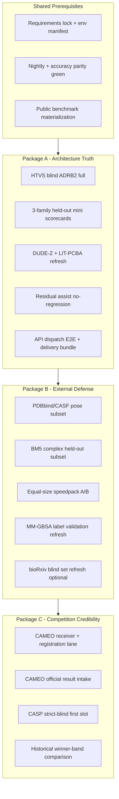

# Architecture Validation Test Packages (A / B / C)

Status: active direction document  
Date: 2026-06-10 KST  
Owner lane: product architecture validation + commercial evidence

## Purpose

This document defines the **implementation direction** for three validation packages that together cover:

1. **Package A** — minimum credible architecture validation for restricted local delivery
2. **Package B** — strong external validation for B2B technical evaluation and publication supplements
3. **Package C** — competitive benchmark validation against historical competition lanes (CAMEO / CASP strict-blind)

All three packages must be implemented. They are **not interchangeable**:

- Package A is the **product truth gate** for restricted `gpcr`, `ion_channel`, and `kinase` delivery.
- Package B is the **third-party defensibility gate** for ligand screening, pose, and physics credibility.
- Package C is the **competition credibility gate** for structure-prediction and live blind-benchmark claims.

This document does **not** register CAMEO servers, submit CASP predictions, enable global execution, or broaden claim scope beyond `docs/local_delivery_claim_policy.md`.

## Related Documents

| Document | Role |
|---|---|
| `docs/local_delivery_claim_policy.md` | Allowed / disallowed delivery wording |
| `docs/local_delivery_runbook.md` | Preflight, bundle validation, hard smoke |
| `BENCHMARKS.md` | Current public benchmark index and claim boundaries |
| `docs/ligand_scaleup_benchmark_plan.md` | 100k / 1M / speedpack A/B methodology |
| `docs/biorxiv_architecture_validation_protocol.md` | Frozen cross-domain blind validation protocol |
| `docs/cameo_transition_prd.md` | CAMEO live blind lane requirements |
| `docs/complete_commercial_product_gap_analysis.md` | P0/P1 science and benchmark gaps |
| `betelgeuze_product/public_benchmark.py` | Required public benchmark suite contract |

## Claim Boundary (All Packages)

### Allowed scope

- Restricted local delivery for `kinase`, `gpcr`, and `ion_channel` only
- Target-scoped or family-held-out evidence with frozen splits and provenance
- Public benchmark scorecards with explicit dataset source URLs
- Residual / assist evidence only when no pass-to-fail regression and no customer-facing ranking change
- Competitive comparison wording only after Package C gates pass

### Disallowed scope

- Broad platform, transporter, CA2/PXR, IDP broader-promotion, or general protein-ligand platform claims
- CASP archive structure-analysis pass rate as structure-prediction competitive proof
- ADRB2 pharmacophore results as broad GPCR-family/router proof
- BM5 proxy DockQ as official DockQ assessment
- Accounting green / master rollup complete as science complete
- Local native accuracy substituted for official CAMEO assessment rows

## Package Relationship



**Dependency rule**

- Package B assumes Package A core gates are green or honestly blocked with recorded negative evidence.
- Package C assumes Package B public-benchmark and physics surfaces are stable enough that competition claims do not outrun product evidence.
- Demo-only smoke runs may precede Package A, but they do **not** satisfy any package.

---

## Shared Prerequisites

Complete before starting Package A execution. Refresh weekly during active implementation.

| ID | Prerequisite | Entry point | Pass artifact | Pass criteria |
|---|---|---|---|---|
| PRE-01 | Repo root + Python env | local machine | `runs/local_delivery_requirements_lock_current.json` | `installed=13/13`, `missing=0`, required set complete |
| PRE-02 | Reproducibility snapshot | `python3 tools/build_local_delivery_environment_manifest.py` | `runs/local_delivery_environment_manifest_current.json` | ROCm default `TORCH_BLAS_PREFER_HIPBLASLT=0` recorded |
| PRE-03 | Accuracy parity | existing scorecard refresh | `runs/accuracy_parity_scorecard_current.md` | `status=green`, no blocked required rows |
| PRE-04 | Nightly gate | existing burndown refresh | `runs/nightly_gate_burndown_packet_current.json` | stage6 / top-level smoke green |
| PRE-05 | Public benchmark contract | `python3 tools/build_product_public_benchmark_contract.py` | `runs/product_public_benchmark_contract_current.json` | 5/5 suites `status=ready` |
| PRE-06 | Hard unit smoke | `docs/local_delivery_runbook.md` hard verification block | pytest + preflight gate | no red smoke before bundle claims |
| PRE-07 | Claim policy read | manual | `docs/local_delivery_claim_policy.md` | team acknowledges restricted scope |

---

# Package A — Minimum Credible Architecture Validation

## Summary

| Field | Value |
|---|---|
| Audience | Internal product sign-off, guarded B2B pilot, restricted delivery bundle |
| Duration | 1–2 engineering days (+ GPU queue time for HTVS full) |
| Primary question | Does the restricted product architecture run end-to-end with honest ranking and bundle evidence? |
| Package complete when | All A-gates pass or fail with recorded negative evidence and no overstated claim |

## Goals

1. Prove the **HTVS architecture** (pocket → trajectory → scoring → ranking → bundle) on a real blind preset.
2. Prove **family-held-out ranking** on the three allowed delivery families.
3. Prove **public benchmark guardrails** on decoy bias and virtual screening.
4. Prove **residual assist safety** (no ranking harm).
5. Prove **API dispatch + delivery bundle** path for product execution evidence.

## Workstreams

### A-WS1 — End-to-end HTVS blind architecture gate

**Purpose:** Validate the core product pipeline, not just accounting artifacts.

| ID | Test | Entry point | Inputs | Outputs | Pass criteria |
|---|---|---|---|---|---|
| A-01 | ADRB2 blind HTVS full | `python3 tools/run_ligand_htvs_pipeline.py --pipeline-preset-json config/ligand_htvs_blind_gpcr_adrb2_4bead_v1.json` | `config/real_drug_targets_blind_gpcr_adrb2_v1.csv`, `config/ligand_binding_reference_blind_gpcr_adrb2_v1.csv`, `--run-scope full` | HTVS summary JSON, stage manifests, ranking eval | operational gate pass: `PR-AUC >= 0.55`, `ranking_pr_auc_ci_lower >= gate`, `top20 >= 0.2`, 4-bead no pass-to-fail vs 2-bead |
| A-02 | ADRB2 blind smoke (regression) | same preset, `--run-scope smoke` | 1-ligand smoke CSV / API materialization | smoke summary | stages complete, no crash, gate may be relaxed but artifacts present |
| A-03 | Product GPCR after-approval gate | existing builder chain | A-01 outputs | `runs/product_gpcr_adrb2_after_approval_summary.json` | `pass=true`, `eval_keys` populated |
| A-04 | Four-bead gate unit regression | `pytest tests/unit/test_gap_closure_e2e.py -k four_bead` | synthetic dataframe | unit pass | pass/fail regression logic unchanged |

**Claim boundary**

- A-01 supports **ADRB2 blind HTVS architecture** evidence.
- A-01 does **not** support broad GPCR-family/router promotion.
- A-02 is CI/demo only.

**Fail actions**

- If A-01 fails operational gate: record negative evidence, do not rewrite gate thresholds post hoc.
- Triage order: native path / split leakage → stage2 trajectory coverage → ranking column / eval role → 4-bead regression → residual assist abstain path.

---

### A-WS2 — Restricted family held-out mini scorecards

**Purpose:** Validate ranking/scoring on the three delivery families with frozen splits.

| ID | Test | Entry point | Inputs | Outputs | Pass criteria |
|---|---|---|---|---|---|
| A-10 | GPCR mini held-out slice | family scorecard builder on frozen packet | GPCR core or A1-repeat-compatible slice | family scorecard JSON/MD | `scorecard_level_status=pass`, hard-decoy / calibration / geometry gates pass per policy |
| A-11 | ion_channel mini held-out slice | same | TRPV1 core slice | scorecard artifact | PR-AUC meets family acceptance profile |
| A-12 | kinase mini held-out slice | same | kinase core / strict slice | scorecard artifact | PR-AUC meets family acceptance profile |
| A-13 | Cross-family bundle identity audit | scorecard builder with `--packet-id` + sha pins | candidate + baseline packets | row identity metadata | `predictions_csv_sha256`, `row_identity_sha256`, ordered `identity_columns` match policy |

**Recommended source specs**

- Cross-domain reference: `config/external_validation_biorxiv_blind_sets_v7_bestofgauntlet1.json`
- Current promoted run reference: `runs/external_validation_blind_runs/external_validation_blind_runs_2026-03-22_biorxiv_v7r1`

**Pass thresholds (restricted delivery, not broad platform)**

| Family | Primary metric | Minimum for Package A |
|---|---|---|
| GPCR | PR-AUC CI-low | `>= 0.45` on declared slice; A1-repeat green is preferred evidence |
| ion_channel | PR-AUC | `>= 0.85` on core slice |
| kinase | PR-AUC | `>= 0.95` on core slice |

**Claim boundary**

- Passing A-10..A-12 supports **restricted family delivery** wording only for the exact slice and packet pinned in the scorecard.
- Frozen non-ADRB2 100k failure remains valid **negative evidence** and must not be overwritten by a smaller green slice.

---

### A-WS3 — Public benchmark guardrail refresh

**Purpose:** Show external dataset guardrails remain green after architecture changes.

| ID | Test | Entry point | Inputs | Outputs | Pass criteria |
|---|---|---|---|---|---|
| A-20 | DUDE-Z decoy smoke refresh | suite run command in public benchmark contract | `data/public_benchmarks/dude_z_decoy_smoke` | `runs/dude_z_decoy_smoke_scorecard_current.json` | `ROC_AUC >= 0.6` |
| A-21 | LIT-PCBA VS refresh | `python3 tools/build_lit_pcba_scorecard.py` | scores + labels CSV | `runs/lit_pcba_scorecard_current.json` | `EF1 >= 1.2` |
| A-22 | Public benchmark contract rebuild | `python3 tools/build_product_public_benchmark_contract.py` | 5 suite scorecards | `runs/product_public_benchmark_contract_current.json` | 5/5 `status=ready` |
| A-23 | Assist replay + comparison gate | `tools/build_public_benchmark_residual_assist_replays.py` → comparisons → gate | shadow + scorecards | assist gate JSON | `assist_comparison_gate_ready=true`, no pass-to-fail regression |

**Claim boundary**

- A-20/A-21 support **public benchmark guardrail** claims only.
- A-23 supports **assist safety**, not public metric improvement (`claim_public_metric_improvement_allowed=false`).

---

### A-WS4 — Residual / assist safety

**Purpose:** Prove AI correction layer does not harm customer-facing rankings.

| ID | Test | Entry point | Inputs | Outputs | Pass criteria |
|---|---|---|---|---|---|
| A-30 | GPCR residual A/B comparison | `python3 tools/build_gpcr_residual_ab_comparison.py` | raw vs residual-active ranking rows | comparison artifact | no pass-to-fail on declared gate |
| A-31 | Residual shadow no-ranking-change | `runs/residual_shadow_ab_current.json` | shadow packet | summary | `no_customer_facing_ranking_change=true` |
| A-32 | Residual energy/force label validation | `python3 tools/build_residual_energy_force_label_validation.py` | refine-tier / proxy labels | validation JSON | `residual_energy_force_label_validation_ready=true` |
| A-33 | Force-residual shortlist hook regression | `pytest tests/unit/test_gap_closure_e2e.py -k force_residual` | unit fixture | pass | hook obeys top fraction policy |

**Claim boundary**

- A-30..A-33 support **residual safety and calibration** only.
- Spearman ~0.39 MM-GBSA proxy is **not** claim-grade ΔG accuracy.

---

### A-WS5 — Product execution and delivery bundle

**Purpose:** Prove the commercial product surface executes and bundles honestly.

| ID | Test | Entry point | Inputs | Outputs | Pass criteria |
|---|---|---|---|---|---|
| A-40 | API dispatch materialization smoke | `config/ligand_htvs_api_dispatch_smoke_v1.json` + dispatch worker | docking request ledger | worker completion + HTVS summary | ledger `worker_state=completed_fail_closed`, stages complete |
| A-41 | Docking request execution posture | `pytest tests/unit/test_betelgeuze_product_docking_request.py` | approval gate artifact | unit pass | `execution_enabled=false`, conditional posture recorded |
| A-42 | Local delivery preflight | `python3 tools/run_local_delivery_preflight.py` | repo state | preflight JSON | `overall_ok=true` |
| A-43 | Verdict gate refresh | `python3 tools/build_local_delivery_verdict_gate.py` | nightly/wetlab/queue artifacts | verdict JSON | `delivery_ready=true` for restricted scope |
| A-44 | Bundle validation | `python3 tools/validate_local_delivery_bundle.py --bundle-dir <bundle>` | assembled bundle | validator summary | `overall_ok=true`, `delivery_ready_policy_ok=true`, fingerprint pass |
| A-45 | Product CLI status set | `python3 -m betelgeuze_product.cli all-status` | local artifacts | CLI JSON | `product_cli_status_set_ready`, core blockers empty |

**Claim boundary**

- A-40 proves **dispatch wiring**, not science superiority.
- A-44 is mandatory before any delivery-ready wording.

---

## Package A — Evidence Refresh Chain

Run in order after all workstreams complete:

```bash
python3 tools/build_product_public_benchmark_contract.py
python3 tools/build_public_benchmark_residual_assist_replays.py
python3 tools/build_public_benchmark_residual_assist_comparisons.py
python3 tools/build_public_benchmark_residual_assist_comparison_gate.py
python3 tools/build_product_infrastructure_gap_closure.py
python3 tools/build_commercial_gap_closure_status.py
python3 tools/build_master_gap_closure_rollup.py
python3 tools/build_goal_readiness_rollup.py
python3 tools/build_goal_release_decision_gate.py
```

## Package A — Sign-Off Checklist

| Gate | Required |
|---|---|
| A-01 HTVS blind full operational pass | yes |
| A-10..A-12 family mini scorecards pass | yes |
| A-20..A-22 public benchmark guardrails pass | yes |
| A-23 assist safety gate pass | yes |
| A-30..A-32 residual safety / calibration pass | yes |
| A-40 dispatch E2E + A-44 bundle validation pass | yes |
| Negative evidence preserved for known blocked lanes | yes |
| Claim wording reviewed against `local_delivery_claim_policy.md` | yes |

---

# Package B — Strong External Validation

## Summary

| Field | Value |
|---|---|
| Audience | B2B technical evaluation, diligence, paper supplement, investor deep dive |
| Duration | 3–5 engineering days (+ dataset runtime) |
| Depends on | Package A complete or honestly blocked with frozen baseline |
| Primary question | Can a third party defend the architecture on public datasets and physics surfaces? |

## Goals

1. Add **pose / affinity / complex** evidence beyond threshold smoke.
2. Add **throughput vs quality** evidence via equal-size speedpack A/B.
3. Refresh **physics / energy label** validation for precision narrative.
4. Optionally refresh the **bioRxiv blind set** under frozen evaluator rules.

## Workstreams

### B-WS1 — PDBbind / CASF pose and affinity subset

**Purpose:** External pose recovery and scoring credibility.

| ID | Test | Entry point | Inputs | Outputs | Pass criteria |
|---|---|---|---|---|---|
| B-01 | PDBbind/CASF materialization audit | public benchmark contract row | `data/public_benchmarks/pdbbind_casf_pose_affinity` | materialization manifest | manifest ready, provenance JSON present |
| B-02 | Pose subset execution | suite `run_command` or dedicated HTVS/backmapping subset runner | 50–200 curated complexes max for first B pass | `runs/pdbbind_casf_pose_affinity_benchmark_results_current.csv` | `pose_success_rate >= 0.35` on full contract; subset must document `n` and selection rule |
| B-03 | Scorecard rebuild | `python3 tools/build_public_benchmark_suite_scorecard.py --suite-id pdbbind_casf_pose_affinity` | B-02 results + provenance | scorecard JSON | `public_benchmark_suite_scorecard_pass` |
| B-04 | Pose diagnostics annex | structure metrics / RMSD proxy tools on subset | predicted vs native for subset | diagnostic CSV/MD | no silent native leak; held-out selection documented |

**Implementation direction**

- Phase 1: refresh scorecard on existing full artifact (already passes contract threshold).
- Phase 2: add **explicit subset manifest** with target IDs, split rule, and pre-native/no-leak statement.
- Phase 3: add per-target pose failure taxonomy (`clash`, `anchor_miss`, `ranking_inversion`, `chemotype_ood`).

**Claim boundary**

- B-02 subset results require explicit `n=` and selection policy in provenance.
- Do not claim CASF official competition rank from internal subset replay.

---

### B-WS2 — BM5 complex docking held-out subset

**Purpose:** Complex / DockQ-proxy credibility without overstating official DockQ.

| ID | Test | Entry point | Inputs | Outputs | Pass criteria |
|---|---|---|---|---|---|
| B-10 | BM5 materialization audit | public benchmark contract row | `data/public_benchmarks/protein_protein_docking_benchmark_v5` | manifest + results CSV | manifest ready |
| B-11 | Held-out subset run | `python3 tools/build_bm5_complex_proxy_results.py` on declared subset | subset manifest | refreshed results CSV | `dockq_acceptable_rate >= 0.2` contract threshold |
| B-12 | Scorecard rebuild | suite scorecard builder | B-11 output | scorecard JSON | pass |
| B-13 | Proxy disclaimer attachment | provenance JSON update | BM5 proxy method note | provenance | explicitly labeled **proxy**, not official DockQ assessment |

**Claim boundary**

- Current high proxy rate (~0.97 on full artifact) must be reported as **rigid-receptor superposition proxy**, not official CAPRI/BM5 assessment reproduction.

---

### B-WS3 — Equal-size speedpack A/B

**Purpose:** Prove production speedups do not destroy claim-safe quality.

| ID | Test | Entry point | Inputs | Outputs | Pass criteria |
|---|---|---|---|---|---|
| B-20 | A/B spec freeze | `python3 tools/run_ligand_speedpack_ab_current.py --validate-only` | baseline spec from `v7_bestofgauntlet1` | A/B spec JSON | task surface frozen |
| B-21 | Equal-size A/B run | `python3 tools/run_ligand_speedpack_ab_current.py` | baseline vs candidate speedpack | comparison artifacts | no pass→fail; `PR-AUC` drop `<= 0.01`; top20 drop `<= 0.05`; stage2 speedup `>= 1.2x` |
| B-22 | A/B summary | `python3 tools/build_ligand_speedpack_ab_summary.py` | B-21 outputs | summary JSON/MD | claim-safe A/B verdict recorded |

Reference: `docs/ligand_scaleup_benchmark_plan.md`

**Claim boundary**

- B-21 supports **equal-size speedpack** claims only.
- Do not merge A/B quality claims into 1M throughput claims.

---

### B-WS4 — Physics / energy precision refresh

**Purpose:** Strengthen the precision narrative without overstating MM-GBSA.

| ID | Test | Entry point | Inputs | Outputs | Pass criteria |
|---|---|---|---|---|---|
| B-30 | Refine-tier batch refresh | refine-tier residual training chain builders | supervised refine sources | training chain JSON | refine label coverage 100% on declared sources |
| B-31 | MM-GBSA / delta_force validation | `python3 tools/build_residual_energy_force_label_validation.py` | energy/force proxy pairs | validation JSON | `residual_energy_force_label_validation_ready=true` |
| B-32 | Accuracy parity refresh | existing parity builder | OpenMM / structure / PDE lanes | `runs/accuracy_parity_scorecard_current.md` | green |
| B-33 | PDE selected all-atom gate refresh | wetlab gate builders | atomized parameterization packet | burndown JSON | `hard_block_count=0` |

**Implementation direction**

- Track Spearman and pair count in every report.
- Do not claim DockQ-grade or experimental ΔG agreement until external metric surface is added.

---

### B-WS5 — Optional bioRxiv blind set refresh

**Purpose:** Revalidate the frozen cross-domain package after major architecture changes.

| ID | Test | Entry point | Inputs | Outputs | Pass criteria |
|---|---|---|---|---|---|
| B-40 | Validate-only spec check | `python3 tools/run_external_validation_blind_sets.py --validate-only --set-spec-json config/external_validation_biorxiv_blind_sets_v7_bestofgauntlet1.json` | frozen spec | validation summary | spec valid |
| B-41 | Full rerun (optional) | `python3 tools/run_external_validation_blind_sets.py` | frozen v7 spec | new run root under `runs/external_validation_blind_runs/` | `set1_core_blind`, `set2_expanded_ood`, `set3_operational_smoke` pass |
| B-42 | Package rebuild | `python3 tools/build_biorxiv_external_validation_package.py` | B-41 outputs | zip + audit JSON | audit pass |

Reference: `docs/biorxiv_architecture_validation_protocol.md`

**Claim boundary**

- B-41 is optional for Package B if Package A family mini scorecards already green and no architecture-breaking change landed.
- Required after any ranking-column, split, or gate-policy change.

---

## Package B — Evidence Refresh Chain

```bash
python3 tools/build_product_public_benchmark_contract.py
python3 tools/build_external_metric_scorecard.py
python3 tools/build_accuracy_parity_scorecard.py
python3 tools/build_residual_energy_force_label_validation.py
python3 tools/build_commercial_gap_closure_status.py
python3 tools/build_data_science_expansion_gap_closure.py
python3 tools/build_master_gap_closure_rollup.py
```

## Package B — Sign-Off Checklist

| Gate | Required |
|---|---|
| B-02 PDBbind/CASF subset executed with provenance | yes |
| B-11 BM5 subset executed with proxy disclaimer | yes |
| B-21 equal-size speedpack A/B claim-safe | yes |
| B-31 MM-GBSA/proxy validation refreshed | yes |
| B-32 accuracy parity green | yes |
| B-40 validate-only spec check | yes |
| B-41 full bioRxiv rerun | optional unless architecture-breaking change |
| Public benchmark contract still 5/5 ready | yes |

---

# Package C — Competitive Benchmark Credibility

## Summary

| Field | Value |
|---|---|
| Audience | External credibility vs historical competition servers / CASP winner bands |
| Duration | weeks to months (external schedule dependent) |
| Depends on | Package A green + Package B public/physics surfaces stable |
| Primary question | Can we compare honestly to past competition teams on blind or official assessment rows? |

## Goals

1. Operate a **live CAMEO blind lane** with official result intake.
2. Build a **CASP strict-blind replay lane** with no-leak provenance.
3. Compare against **historical winner bands** without fake SUM Z-score claims.
4. Keep competition claims separate from restricted delivery claims.

## Workstreams

### C-WS1 — CAMEO live blind lane

**Purpose:** Real weekly blind benchmark against other registered servers.

| ID | Test | Entry point | Inputs | Outputs | Pass criteria |
|---|---|---|---|---|---|
| C-01 | API dependency readiness | `python3 tools/build_cameo_api_dependency_readiness.py` | API deps | readiness JSON | `cameo_api_dependency_ready` |
| C-02 | Receiver smoke contract | `python3 tools/build_cameo_receiver_smoke_contract.py` | receiver module | smoke JSON | `cameo_receiver_smoke_ready` |
| C-03 | Format validation packet | `python3 tools/build_cameo_format_validation_packet.py` | local PDB/mmCIF fixtures | format packet | ready |
| C-04 | Model1 selection packet | `python3 tools/build_cameo_model1_selection_packet.py` | selector policy | selection packet | ready |
| C-05 | Dry-run handoff | `python3 tools/build_cameo_dry_run_handoff_packet.py` | handoff fixtures | handoff packet | ready |
| C-06 | Public registration approval gate | operator tokens + dossier | capability preflight + ops dossier | approval gate | `authorized_for_registration_review=true` |
| C-07 | 24/7 hosted receiver deploy | deploy rollout + TLS ingress | product rollout plan | live endpoint | POST/GET `/cameo/targets` reachable with TLS |
| C-08 | Outbound email send preflight | `python3 tools/build_cameo_outbound_email_send_preflight.py` | operator email policy | preflight JSON | approval-gated send path documented |
| C-09 | Official result intake | operator fills `runs/cameo_official_results_operator_intake.csv` | official CAMEO assessment rows | intake gate pass | `official_cameo_results_used=true` |
| C-10 | Performance scorecard | `python3 tools/build_cameo_performance_scorecard.py` | C-09 CSV | performance JSON | `cameo_performance_evidence_ready` |
| C-11 | Validation readiness gate | `python3 tools/build_cameo_validation_readiness_gate.py` | C-01..C-10 artifacts | readiness gate | `cameo_validation_evidence_ready` |

Reference: `docs/cameo_transition_prd.md`, `betelgeuze_cameo/official_results.py`

**Claim boundary**

- C-07..C-11 are required before any **live server** or **official CAMEO ranking** claim.
- Local native accuracy must not substitute for C-09 official rows.

---

### C-WS2 — CASP strict-blind historical replay

**Purpose:** Honest comparison to CASP15/16 winner bands without fake competitive proof.

| ID | Test | Entry point | Inputs | Outputs | Pass criteria |
|---|---|---|---|---|---|
| C-20 | Strict-blind source request board | `casp17/strict_blind_monomer_pre_native_acquisition_board/` | operator pre-native source | source request artifacts | first slot source verified |
| C-21 | Operator fill batch | `casp17/strict_blind_source_request_operator_fill_batch_kit/operator_fill_intake_batch.csv` | timestamp + no-leak evidence | filled batch | required fields non-placeholder |
| C-22 | Internal prediction source gate | `python3 tools/build_casp17_strict_blind_internal_prediction_source_gate.py` | C-21 batch | gate JSON | first slot closure ready |
| C-23 | Official archive baseline score ledger | CASP official archive ingestion | baseline models + native authority | score ledger JSON | baseline-only proxy ledger ready |
| C-24 | First baseline replay comparison | `python3 tools/casp17/build_casp17_official_archive_first_baseline_replay_comparison.py` | C-23 ledger | comparison MD/JSON | artifact ready; comparison status honestly labeled |
| C-25 | Historical winner-normalized bands | CASP17 historical band contract builder | strict-blind metric rows | bands MD/JSON | band status moves from `blocked_input` only when metric rows ready |
| C-26 | Competitive floor metric surface | operator metric batch fill | GDT_TS, lDDT, TM, DockQ, LDDT-PLI rows | metric surface | target `480/480` required files per CASP17 ops docs |

Reference: `casp17/CASP17_HISTORICAL_WINNER_NORMALIZED_BANDS.md`, `casp17/CASP17_OFFICIAL_ARCHIVE_FIRST_BASELINE_REPLAY_COMPARISON.md`

**Claim boundary**

- C-24 is **baseline-only proxy comparison**, not official CASP assessment.
- C-25 requires **strict-blind historical metric surface**; current status is `0/440` metric rows ready.
- Never import official archive models as internal predictions (`proof eligible: false` policy).

---

### C-WS3 — Unified competition comparison report

**Purpose:** One operator-facing report that separates live CAMEO vs CASP historical lanes.

| ID | Deliverable | Contents |
|---|---|---|
| C-30 | `docs/competition_benchmark_status_current.md` (to create) | CAMEO live status, official results count, CASP strict-blind slot count, winner-band table |
| C-31 | `runs/competition_benchmark_rollup_current.json` (to create) | machine-readable rollup for goal/product API surfaces |
| C-32 | Comparison disclaimer block | fixed wording: not official CASP assessment; not local-native substitution |

**Implementation direction**

- Add builders only after C-09 or C-22 first honest pass.
- Expose read-only status via product API only; no claim promotion by default.

---

## Package C — Phased Rollout

| Phase | Scope | Exit criterion |
|---|---|---|
| C-P0 | C-01..C-06 local preflight only | all local CAMEO packets ready, registration approval gate documented |
| C-P1 | C-07 live receiver + C-08 email path | blind target intake on staging/production endpoint |
| C-P2 | C-09..C-11 first official CAMEO results | `cameo_validation_evidence_ready` |
| C-P3 | C-20..C-22 first strict-blind slot | one slot with verified pre-native provenance |
| C-P4 | C-23..C-25 metric surface + band comparison | winner band no longer `blocked_strict_blind_historical_metric_surface_missing` for at least one band |
| C-P5 | C-30..C-32 unified competition report | operator-facing report published |

## Package C — Sign-Off Checklist

| Gate | Required for competition claims |
|---|---|
| C-11 CAMEO validation evidence ready | live CAMEO claim |
| C-09 official results used | any CAMEO ranking comparison |
| C-22 strict-blind first slot closed | CASP strict-blind claim |
| C-25 at least one winner band not blocked | historical team band comparison |
| C-32 disclaimer attached to all competition outputs | always |

---

# Master Implementation Roadmap

## Phase timeline

| Phase | Package | Target | Calendar |
|---|---|---|---|
| Phase 1 | A | restricted delivery architecture truth | week 1 |
| Phase 2 | B | external defense + speedpack A/B | weeks 2–3 |
| Phase 3 | C-P0..P2 | CAMEO live + official results | weeks 4–8 |
| Phase 4 | C-P3..P5 | CASP strict-blind + winner bands | weeks 6–12+ |

Phases 3 and 4 may overlap, but **C-P2 must not be claimed before A and B sign-off**.

## Priority order inside engineering

1. A-01 HTVS blind full
2. A-10..A-12 family mini scorecards
3. A-44 delivery bundle validation
4. B-21 speedpack A/B
5. B-02 PDBbind/CASF subset with provenance
6. C-01..C-06 CAMEO local preflight
7. C-20..C-22 CASP strict-blind first slot
8. C-09 official CAMEO intake
9. C-25 winner-band metric surface

## CI / regression mapping

| Layer | Minimum CI |
|---|---|
| L1 always-on | pytest gap closure, docking request, public benchmark builders, goal release gate |
| L1 nightly | nightly stage6, accuracy gate, Morton parity |
| L2 weekly | Package A smoke subset (A-02, A-20, A-40) |
| L2 release candidate | full Package A |
| L3 milestone | Package B |
| L4 external milestone | Package C phase exits |

---

# Artifact Index

| Artifact | Package | Meaning |
|---|---|---|
| `runs/product_gpcr_adrb2_after_approval_summary.json` | A | HTVS blind architecture gate |
| `runs/product_public_benchmark_contract_current.json` | A,B | 5-suite public benchmark contract |
| `runs/public_benchmark_residual_assist_comparison_gate_current.json` | A | assist safety |
| `runs/local_delivery_verdict_gate_current.json` | A | restricted delivery verdict |
| `runs/pdbbind_casf_pose_affinity_scorecard_current.json` | B | pose/affinity external gate |
| `runs/protein_protein_docking_benchmark_v5_scorecard_current.json` | B | complex proxy gate |
| `runs/ligand_speedpack_ab_current/` | B | equal-size speedpack evidence |
| `runs/residual_energy_force_label_validation_current.json` | A,B | physics proxy validation |
| `runs/cameo_validation_readiness_gate_current.json` | C | CAMEO readiness |
| `runs/cameo_official_results_operator_intake.csv` | C | official CAMEO rows (operator) |
| `casp17/CASP17_HISTORICAL_WINNER_NORMALIZED_BANDS.md` | C | winner band contract |
| `casp17/CASP17_OFFICIAL_ARCHIVE_FIRST_BASELINE_REPLAY_COMPARISON.md` | C | baseline replay comparison |

---

# Reporting Template

Each package run must produce a short operator summary with:

1. **Package ID** (A / B / C)
2. **Run tag** (`YYYYMMDD_<lane>`)
3. **Git SHA**
4. **Pass/fail table** by test ID
5. **Claim allowed / blocked** list
6. **Negative evidence preserved** list
7. **Next required action**

Suggested output path:

- `runs/architecture_validation_package_a_report_current.md`
- `runs/architecture_validation_package_b_report_current.md`
- `runs/architecture_validation_package_c_report_current.md`

---

# Implementation Notes for Future Builders

The following builder surfaces are **not yet required** but are the expected implementation follow-ups for this document:

1. `tools/product/build_architecture_validation_package_report.py` — aggregate A/B/C checklist status from existing artifacts
2. `docs/competition_benchmark_status_current.md` — operator-facing competition lane status (Package C)
3. PDBbind/CASF and BM5 **subset manifest** builders with explicit held-out selection policy (Package B)
4. Read-only product API fields for package A/B/C status without auto-promoting claims

Until those builders exist, use the manual checklist in this document and the artifact index above as the source of truth.
