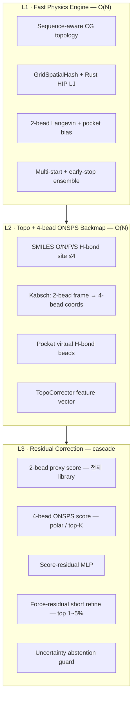

# 독립 엔진 · AI 후보정 · 4-bead ONSPS 정밀화 로드맵

작성일: 2026-06-06 KST  
상태: **OPEN** (엔진·알고리즘 설계 로드맵)  
선행: [P0/P1 closure](p0_p1_closure_status.md) **CLOSED**, [P2 expansion](p2_expansion_plan.md) **CLOSED**  
관련: [Top-K cascade](topk_cascade_architecture_plan.md), [GPCR residual prototype](gpcr_residual_prototype_plan.md), [Stage2 speedpack](ligand_stage2_production_speedpack_plan.md)

---

## 0. 요약

이 문서는 다음 논의를 **단일 실행 로드맵**으로 통합한다.

1. 현재 아키텍처에서 엔진·알고리즘 개선이 필요한 지점
2. **외부 도킹 엔진 없이** 상용 독립 엔진을 구축하는 전략
3. **O(N) 간소화 물리** + **AI 잔차보정·위상보정** 후처리로 속도·정확도 균형
4. **O/N/P/S 수소결합 4-bead 백맵핑**을 scoring 단계에 추가하는 선택적 정밀화

### 설계 원칙 (고정)

| 원칙 | 내용 |
|------|------|
| **독립 엔진** | AutoDock/Vina/OpenMM 등 외부 **도킹·MD 엔진**에 의존하지 않음. RDKit(SMILES parsing) 등 화학 informatics는 허용. |
| **O(N) 유지** | spatial hash + bounded neighbor(K). dynamics·scoring 모두 bead/이웃 상한으로 선형 복잡도 유지. |
| **빠른 coarse → 느린 refine** | Stage2는 2-bead CG dynamics. 정밀화·AI 보정은 Stage3 이후 cascade. |
| **fail-closed 상용** | uncertainty·yellow band·`max_abs_delta`·abstention guard. shadow → assist → production 단계 승격. |

### 로드맵 Phase 개요

| Phase | 이름 | 목표 |
|-------|------|------|
| **E0** | 기반 정리 | topology placeholder 제거, broken module 수정, O(N) 병목 제거 |
| **E1** | L1 Fast Physics | sequence-aware CG, multi-start, Rust fast path 확장 |
| **E2** | L2 Topo + 4-bead ONSPS | SMILES 기반 H-bond site backmapping, pocket virtual bead |
| **E3** | L3 Score-residual | family별 score-residual production, cascade routing |
| **E4** | L3 Force-residual (top-K) | shortlist force refine, specialist 최소 물리 |
| **E5** | Product 연결 | ledger → worker dispatch, pose delivery gate |

처리 순서: **E0 → E1 → E2 → E3 → (E4) → E5**  
(E2·E3는 부분 병렬 가능. E4는 top-K cascade 성숙 후.)

---

## 1. 현재 아키텍처 진단

### 1.1 이중 구조

```
[실제 과학 엔진]                    [상용 제품 표면]
tools/ HTVS pipeline          vs    betelgeuze_product/ + api/
core/ + rust_engine/                intake · contract · fail-closed ledger
```

| 층 | 경로 | 성숙도 |
|----|------|--------|
| HTVS CLI pipeline | `tools/run_ligand_htvs_pipeline.py` | 내부 운영 가능 (operator gate) |
| Trajectory (pose sampler) | `tools/generate_ligand_trajectory_engine.py` | 2-bead CG Langevin + Rust HIP |
| Scoring / ranking | `tools/run_ligand_backmapping_scoring.py` | proxy MMPBSA + calibration |
| Core physics | `core/forcefield.py`, `core/spatial.py` | LJ + GridSpatialHash O(N) |
| AI orchestrator | `theory/strategy.py` | scaffold (specialist zero-output) |
| Product docking | `betelgeuze_product/docking_request.py` | intake only (`execution_enabled=false`) |

**주의:** “도킹 요청 접수” ≠ “도킹 계산 완료”. 상용 연결(E5) 전까지 고객-facing pose는 emit되지 않음.

### 1.2 성숙도 매트릭스

| 컴포넌트 | 상태 | 비고 |
|----------|------|------|
| HTVS end-to-end CLI | ✅ 운영 | subprocess stage chain |
| 2-bead trajectory | ✅ 동작 | classical docking search 아님 |
| Rust HIP fused rollout | ✅ (조건부) | early-stop/contact term 시 비활성 |
| Proxy scoring | ✅ 동작 | ΔG 엔진 아님 |
| 3bead implicit hbond | ⚠️ 제한적 | 기하학적 가상 bead 1개, 화학 무관 |
| ONSPS (O/N/P/S) | ⚠️ scalar만 | `_onsps_from_smiles()` 개수 feature |
| AI score-residual | ⚠️ GPCR shadow | kinase/ion_channel noop |
| AI force-residual | ❌ stub | specialist `always_zero_output=True` |
| `core/ai_correction.py` | ❌ broken | `nb_idx` 미정의 |
| Topology fidelity | ❌ placeholder | default all-Alanine |
| Customer pose delivery | ❌ blocked | `docking_results_emitted=false` |

### 1.3 O(N)이 깨지는 지점

| 위치 | 문제 | 목표 |
|------|------|------|
| `_compute_ligand_extra_force` | ligand×protein all-pairs | pocket-local hash로 제한 |
| Python `ff.compute` loop | 매 step neighbor rebuild | Rust HIP 기본화 |
| `core/spatial.py` fallback | Python cell loop | HIP neighbor only in production |
| Stage3 frame scoring | per-frame Python/RDKit | vectorize + fixed-bead 상한 |

---

## 2. 목표 3층 아키텍처



### 2.1 L1 — Fast Physics (변경 최소, throughput 핵심)

- **입력:** protein CA (+ virtual SC), ligand 2-bead
- **연산:** `ForceField` LJ + pocket attraction + Langevin (`core/`, `rust_engine/`)
- **출력:** subsampled trajectory NPZ
- **복잡도:** O(N) per step (neighbor rebuild 최소화)

Dynamics 안에 AI/GNN을 넣지 않는다. AI는 L2·L3에서만.

### 2.2 L2 — Topo + 4-bead ONSPS Backmap (정밀화 핵심)

- **입력:** 2-bead trajectory frame + SMILES + pocket residue context
- **연산:** O/N/P/S H-bond site 최대 4개 좌표 복원 → 정밀 H-bond scoring
- **출력:** 4-bead ligand coords, H-bond feature vector, `2bead_vs_4bead_delta`
- **복잡도:** O(4×N) = O(N); SMILES conformer는 ligand당 O(1)

### 2.3 L3 — Residual Correction (정확도 회수)

| 경로 | 범위 | 비용 | 용도 |
|------|------|------|------|
| Score-residual | 전체 또는 polar family | O(1) per candidate | ranking |
| 4-bead rescoring | ONSPS≥1 또는 top-K | O(N) per candidate | H-bond 정밀화 |
| Force-residual | top 1~5% | O(N)×short steps | pose refine |

Score-error ≠ force-error. **별도 모델·별도 gate.**

---

## 3. 4-bead ONSPS 백맵핑 설계

### 3.1 현재 3bead 한계

`tools/run_ligand_backmapping_scoring.py`의 `3bead_implicit_hbond`:

- 2-bead 축에 **수직 가상 bead 1개** (`_virtual_third_bead`)
- O/N/P/S는 `onsps_norm` **scalar 가중치**만 반영
- H-bond geometry: 단일 Gaussian (d≈2.9Å)

### 3.2 4bead_onsps_hbond 정의

**Bead 선별 (SMILES, RDKit):**

| 우선순위 | 원자 | 선별 |
|----------|------|------|
| 1 | O | carbonyl, hydroxyl, ether acceptor |
| 2 | N | amine, amide, heteroaryl donor/acceptor |
| 3 | S | thiol, sulfoxide |
| 4 | P | phosphate, phosphonate |

최대 4 site. 부족하면 있는 만큼만 사용.

**좌표 복원 (per frame):**

1. SMILES에서 ETKDG conformer 1회 생성 (dynamics 밖)
2. ONSPS site + 2-bead centroid 정의
3. Kabsch alignment: conformer (bead0, bead1) ↔ trajectory (b0, b1)
4. R/T를 ONSPS 4 site에 적용
5. pocket clash relief (`_relieve_ligand_clashes` 확장)

**단백질 측 (pocket virtual bead):**

- sequence-aware virtual SC (`core/topology.py`)
- SER/THR/TYR → donor/acceptor O; ASP/GLU → acceptor O; LYS/ARG/HIS → donor N

**Scoring (4-bead 전용):**

- 원자별 거리 term + donor–acceptor 방향성 (angle proxy)
- unsatisfied donor/acceptor count → solvation penalty
- `hbond_onsps_weight` → 원자 타입별 가중치로 세분화

### 3.3 Cascade 적용 조건

```
전체 library     → ligand_model=2bead (기본)
ONSPS site ≥ 1
  AND (polar family ∈ {gpcr, kinase} OR rank_pct ≤ 5%)
  → ligand_model=4bead_onsps_hbond
```

`3bead_implicit_hbond`는 `4bead_onsps_hbond`로 **대체·deprecated**.

### 3.4 AI 보정 연동

4-bead feature vector (TopoCorrector / score-residual 입력):

- `onsps_bead_min_distances[4]`
- `onsps_hbond_angle_scores[4]`
- `donor_acceptor_role_match[4]`
- `unsatisfied_donor_count`, `unsatisfied_acceptor_count`
- `score_2bead`, `score_4bead`, `delta_backmap` (uncertainty signal)

`delta_backmap`이 크면 yellow band / abstention.

---

## 4. Phase별 작업계획

### Phase E0 — 기반 정리 (선행 필수)

**문제:** half-implemented module이 production 신뢰를 깎음.

| ID | 작업 | 주요 파일 | 수용 기준 |
|----|------|-----------|-----------|
| E0-1 | `core/ai_correction.py` 수정 (`nb_idx`, `Config` import) | `core/ai_correction.py` | import·forward 단위 테스트 green |
| E0-2 | topology placeholder 제거 → sequence-aware 기본 | `core/topology.py`, trajectory engine | `topology_fidelity != placeholder_alanine` in HTVS default |
| E0-3 | AdResS stub 비활성화 또는 명시적 gate | `core/topology.py` | random neighbor path unreachable in production |
| E0-4 | specialist zero-force → 최소 analytic term | `theory/branches/*_logic.py` | H-bond/hydrophobic distance potential non-zero |
| E0-5 | Python neighbor rebuild 최소화 | `generate_ligand_trajectory_engine.py`, `core/forcefield.py` | production profile에서 Rust HIP default |
| E0-6 | ligand×protein all-pairs → pocket-local | `_compute_ligand_extra_force` | pocket atom cap documented |

**검증:**

```bash
python3 -m pytest -q tests/unit/test_api_validated_runner_adapter.py
python3 tools/product/validate_api_runner_profiles.py --profiles-dir config/api_validated_runner_profiles
python3 -m py_compile core/ai_correction.py core/topology.py core/forcefield.py
```

---

### Phase E1 — L1 Fast Physics 강화

**목표:** Stage2 throughput 유지·개선. [Stage2 speedpack](ligand_stage2_production_speedpack_plan.md) 연계.

| ID | 작업 | 수용 기준 |
|----|------|-----------|
| E1-1 | multi-start pose (bias-free baseline 포함) | 동일 ligand N-start pose diversity metric |
| E1-2 | early-stop + contact attract Rust kernel 통합 | `native_rollout_ok` 조건 완화, fast path 유지 |
| E1-3 | `traj_prod_*` production config family 정리 | frozen validation path와 분리 |
| E1-4 | protein pocket virtual SC (sequence injection) | family-specific contact 통계 개선 |

**처리량 목표 (참고):** [Top-K cascade envelope](topk_cascade_architecture_plan.md) — stage2 share ~86%; 2× speedup은 stage2 skip/router 품질에 의존.

---

### Phase E2 — L2 Topo + 4-bead ONSPS Backmap

**목표:** scoring 단계 선택적 정밀화. Dynamics는 2-bead 유지.

| ID | 작업 | 주요 파일 | 수용 기준 |
|----|------|-----------|-----------|
| E2-1 | `_onsps_hbond_sites_from_smiles()` | `run_ligand_backmapping_scoring.py` | donor/acceptor site ≤4, unit test with SMILES fixtures |
| E2-2 | `_backmap_4bead_onsps()` (Kabsch) |同上 | 2-bead frame → 4 coords, clash relief hook |
| E2-3 | `ligand_model=4bead_onsps_hbond` in `_frame_mmpbsa_proxy` |同上 | 원자별 e_polar, angle term, ONSPS solvation |
| E2-4 | pocket virtual H-bond bead | `core/topology.py` | CA+virtual SC H-bond pairing |
| E2-5 | cascade selector `_needs_onsps_4bead()` |同上 + HTVS config | polar family / top-K 자동 전환 |
| E2-6 | queue metadata | `build_ligand_mapping_queue.py` | `onsps_site_count`, `ligand_model_hint` |
| E2-7 | benchmark gate | `config/ligand_htvs_blind_*.json` | GPCR hard-decoy H-bond metric regression |

**검증:**

```bash
python3 tools/run_ligand_backmapping_scoring.py \
  --ligand-model 4bead_onsps_hbond \
  --queue-csv <fixture> --score-only --allow-missing-trajectory
python3 -m pytest -q tests/unit/test_*backmap*  # E2-7에서 추가
```

**Claim boundary:** 4-bead는 **proxy 정밀화**이지 all-atom ΔG 또는 외부 도킹 parity claim 아님.

---

### Phase E3 — L3 Score-residual Production

**목표:** [GPCR residual prototype](gpcr_residual_prototype_plan.md)를 family 전반으로 확장.

| ID | 작업 | 수용 기준 |
|----|------|-----------|
| E3-1 | score-residual MLP checkpoint + registry | `runs/residual_model_registry_current.json` preflight green |
| E3-2 | kinase / ion_channel shadow → assist | `_apply_residual_prototype_shadow` noop 제거 |
| E3-3 | 4-bead feature를 residual 입력에 concat | shadow replay beats v2 without metric regression |
| E3-4 | `max_abs_delta`, yellow band, abstention | product AI decision graph contract |
| E3-5 | TopoCorrector (경량 MLP) | fixed-dim in, score delta out |
| E3-6 | production 승격 gate | `customer_facing_auto_correction_allowed` explicit |

**Cascade (전체 흐름):**

```
Stage3a: 2-bead proxy score     → 전체
Stage3b: 4-bead ONSPS (조건부)  → polar / top-K
Stage3c: score-residual MLP     → family별
Stage3d: rank + uncertainty     → abstain if low confidence
```

---

### Phase E4 — L3 Force-residual (top-K, 선택)

**목표:** shortlist pose refine. 비용 높음 — top 1~5% only.

| ID | 작업 | 수용 기준 |
|----|------|-----------|
| E4-1 | `StrategicOrchestrator` shortlist hook | top-K만 force residual invoke |
| E4-2 | distilled residual dataset pipeline | `train/distilled_dataset.py` NPZ with `residual_forces` |
| E4-3 | `PhysicsGuard` + local teacher (non-random) | energy drift ≤1.5% with correction |
| E4-4 | 4-bead analytic H-bond in `hbond_logic.py` | non-zero force, router fallback 감소 |
| E4-5 | force-residual → re-score loop | top-K rank 변경 measurable on blind set |

**제외 (명시):** 전체 library force-residual — O(N)×steps 비용으로 상용 throughput 목표와 충돌.

---

### Phase E5 — Product 연결

**목표:** 독립 엔진이 상용 제품 경로에서 end-to-end 실행.

| ID | 작업 | 수용 기준 |
|----|------|-----------|
| E5-1 | `docking_request` ledger → worker HTVS dispatch | operator-approved runner profile |
| E5-2 | `scoring_ranking_contract` gate open | architecture contract `ready` |
| E5-3 | `run_ligand_topk_delivery.py` pose bundle | `docking_results_emitted=true` (scoped) |
| E5-4 | API `/simulate` + product docking 통합 문서 | claim boundary explicit |
| E5-5 | CI contract fixture + bootstrap | `product-api-worker` green |

P0/P1에서 `execution_enabled=false` 고정은 **의도적 fail-closed**. E5는 operator gate·benchmark 증거 충족 후 단계 승격.

---

## 5. 구현 우선순위 (ROI 순)

| 순위 | Phase | 작업 | 기대 효과 |
|------|-------|------|-----------|
| 1 | E0 | topology sequence-aware | 전 layer 입력 품질 |
| 2 | E2 | 4-bead ONSPS backmap | H-bond 정밀화 (논의 핵심) |
| 3 | E3 | score-residual production | 빠른 정확도 회수 O(1) |
| 4 | E1 | Rust early-stop 통합 | stage2 throughput |
| 5 | E0 | specialist 최소 물리 | force-residual 학습 의미 |
| 6 | E4 | top-K force-residual | shortlist pose 품질 |
| 7 | E5 | product dispatch | 상용 가동 |

---

## 6. 피해야 할 함정

| 함정 | 이유 | 대안 |
|------|------|------|
| Dynamics 안에 AI/GNN | O(N) 깨짐, step 비용 폭발 | L2·L3 post-hoc only |
| 3bead 유지 | 화학 무관 geometry | 4bead_onsps_hbond로 대체 |
| Score·force 단일 모델 | error mode 다름 | cascade 분리 |
| 전체 library force-residual | throughput 붕괴 | top-K only |
| all-atom backmapping | O(N×M) | ligand 4-bead + pocket virtual |
| AdResS half-on | scientifically invalid | gate off or full impl |
| 외부 도킹 엔진 도입 | 독립성 상실 | 자체 HTVS + AI 보정 |

---

## 7. 관련 아티팩트·문서

| 문서 / artifact | 역할 |
|-----------------|------|
| `docs/topk_cascade_architecture_plan.md` | stage2 skip·residual router throughput |
| `docs/gpcr_residual_prototype_plan.md` | score-residual shadow 규칙 |
| `docs/ligand_stage2_production_speedpack_plan.md` | L1 early-stop·frame budget |
| `docs/global_residual_correction_target_list.md` | family별 correction target |
| `runs/ligand_cascade_speedup_envelope_current.json` | cascade speedup envelope |
| `runs/product_architecture_contract_current.json` | execution/scoring gate 상태 |
| `core/claim_boundary.py` | topology_fidelity claim |

---

## 8. 로드맵 상태 추적

| Phase | 상태 | 비고 |
|-------|------|------|
| E0 | ⬜ OPEN | |
| E1 | ⬜ OPEN | speedpack 부분 적용됨 |
| E2 | ⬜ OPEN | 3bead만 존재, 4bead 미구현 |
| E3 | ⬜ OPEN | GPCR shadow only |
| E4 | ⬜ OPEN | |
| E5 | ⬜ OPEN | P0/P1 fail-closed 유지 |

**다음 즉시 작업 (권장):** E2-1~E2-3 (`4bead_onsps_hbond` scoring path) + E0-2 (sequence-aware topology).

---

## 9. Claim boundary (고정)

- 이 로드맵의 엔진 개선은 **restricted scope** (`kinase`, `gpcr`, `ion_channel`) HTVS·랭킹 신뢰도 향상용.
- 4-bead ONSPS·AI residual은 **내부 proxy·assist**이며 OpenMM/Schrödinger/Vina parity claim 아님.
- `topology_fidelity=placeholder_alanine` 산출물은 accuracy grade promotion **blocked** (`core/claim_boundary.py`).
- Customer-facing auto-correction은 registry preflight + benchmark gate 통과 후에만 (`residual_production_checkpoint_preflight`).

---

*이 문서는 엔진·알고리즘 설계 로드맵이다. 상용화 gate·accounting 상태는 `runs/commercialization_readiness_current.json` 및 [commercialization_status_summary](commercialization_status_summary.md)를 authoritative source로 한다.*
